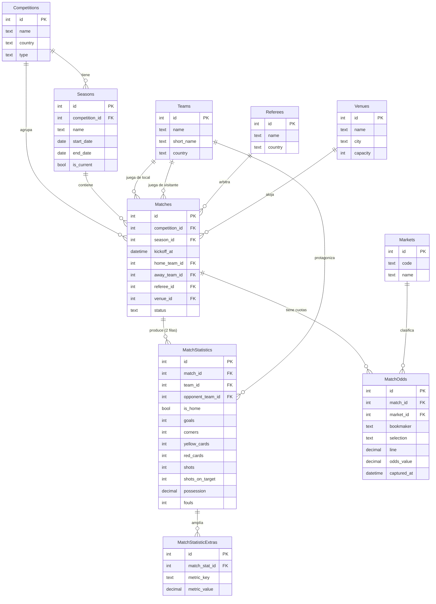

# Diseño del modelo de datos — Bet Analyzer AI (v1)

> **Estado:** propuesta de diseño para revisión. **No** contiene SQL ni modelos de
> SQLAlchemy: solo el modelo conceptual (tablas, columnas, tipos conceptuales y
> relaciones) para discutir antes de traducirlo a SQL Server.

---

## 0. Principios que guían el diseño

1. **Solo hechos crudos, nunca promedios.** La base de datos guarda lo que
   *ocurrió* en cada partido (goles, córners, tarjetas…). Los promedios,
   rachas y estadísticas derivadas (últimos 5, 10, 20 partidos, medias
   local/visitante, etc.) **no se almacenan**: los calcula el `engine/` a
   partir de los hechos crudos. Así podemos cambiar de fórmula sin perder
   datos ni tener que reprocesar cargas históricas.

2. **Normalización sobre repetición.** Equipos, árbitros, competiciones y
   temporadas viven en su propia tabla y se referencian por clave foránea. Un
   equipo se escribe una sola vez; si cambia su nombre, se corrige en un único
   lugar.

3. **Crecer sin rediseñar.** El modelo v1 está pensado para que agregar una
   liga, un mercado o cientos de variables nuevas sea **añadir filas o una
   tabla**, nunca reestructurar lo existente.

4. **Alcance v1.** Una sola competición (Liga Profesional Argentina) y 4
   mercados de análisis: **Goles, Córners, Tarjetas y BTTS**. El modelo, sin
   embargo, no asume "una sola liga": está preparado multi-competición desde el
   día uno porque eso no cuesta nada ahora y evita una migración dolorosa
   después.

5. **Convenciones.** Nombres de tablas en inglés y en plural (`Teams`,
   `Matches`). Toda tabla tiene una clave primaria propia, entera y
   autoincremental (una *surrogate key*), independiente de identificadores
   externos. Las fechas/horas se guardan siempre en un mismo huso (UTC) y se
   presentan en hora local en la capa de aplicación.

### Tipos conceptuales usados

En este documento **no** se usa sintaxis de SQL Server. Los tipos son
conceptuales y se traducirán después:

| Tipo conceptual | Significado                                             |
|-----------------|--------------------------------------------------------|
| `entero`        | Número entero (ids, conteos como goles o córners).     |
| `texto`         | Cadena de caracteres (nombres, códigos, descripciones).|
| `fecha`         | Fecha sin hora.                                        |
| `fecha-hora`    | Fecha con hora (marca temporal).                       |
| `booleano`      | Verdadero/falso.                                        |
| `decimal`       | Número con decimales (posesión %, cuotas).             |

---

## 1. Competitions — Competiciones / torneos

**Propósito.** Catálogo de las competiciones que analizamos (en v1, solo la
Liga Profesional Argentina). Existe para no repetir el nombre de la competición
en cada partido y para poder crecer a varias ligas/copas sin tocar el resto del
modelo.

| Columna       | Tipo conceptual | Descripción                                                        |
|---------------|-----------------|--------------------------------------------------------------------|
| `id`          | entero          | Clave primaria (surrogate).                                        |
| `name`        | texto           | Nombre de la competición (p. ej. "Liga Profesional Argentina").    |
| `country`     | texto           | País/región de la competición ("Argentina").                       |
| `type`        | texto           | Tipo: liga, copa, torneo internacional… (catálogo simple de texto).|
| `external_ref`| texto           | Identificador de la competición en la fuente de datos externa.     |
| `created_at`  | fecha-hora      | Auditoría: cuándo se registró la fila.                             |

- **Clave primaria:** `id`.
- **Claves foráneas:** ninguna.

**Escalabilidad.** Agregar una liga nueva = insertar **una fila**. El resto del
modelo la referencia por `id`, así que nada más cambia. `type` permite mezclar
ligas y copas sin columnas nuevas.

---

## 2. Seasons — Temporadas

**Propósito.** Una competición se juega por temporadas (2024, 2025, Apertura,
Clausura…). Separar la temporada de la competición permite guardar años de
historia de la misma liga y calcular estadísticas "de la temporada actual" vs.
"histórico". Es imprescindible para el principio de datos crudos: los promedios
casi siempre se calculan dentro de una ventana temporal, y la temporada es la
ventana natural.

| Columna          | Tipo conceptual | Descripción                                                      |
|------------------|-----------------|------------------------------------------------------------------|
| `id`             | entero          | Clave primaria.                                                  |
| `competition_id` | entero          | Competición a la que pertenece la temporada (FK).               |
| `name`           | texto           | Nombre visible ("2025", "Apertura 2025").                        |
| `start_date`     | fecha           | Fecha de inicio de la temporada.                                |
| `end_date`       | fecha           | Fecha de fin (puede quedar vacía si está en curso).             |
| `is_current`     | booleano        | Marca la temporada activa (comodidad para consultas).           |
| `external_ref`   | texto           | Identificador de la temporada en la fuente externa.             |

- **Clave primaria:** `id`.
- **Claves foráneas:** `competition_id` → `Competitions.id`.

**Escalabilidad.** Cada año nuevo = una fila. Soporta formatos distintos
(Apertura/Clausura, temporada de un año o de dos años cruzados) sin cambios de
esquema, porque el formato se expresa con `name`, `start_date` y `end_date`.

---

## 3. Teams — Equipos

**Propósito.** Catálogo de equipos. Un equipo se guarda una sola vez y se
referencia desde los partidos y las estadísticas. Evita inconsistencias de
nombre ("River", "River Plate", "C. A. River Plate") y permite adjuntar en el
futuro atributos del club (escudo, ciudad, estadio propio).

| Columna       | Tipo conceptual | Descripción                                                    |
|---------------|-----------------|----------------------------------------------------------------|
| `id`          | entero          | Clave primaria.                                                |
| `name`        | texto           | Nombre oficial/largo del club.                                 |
| `short_name`  | texto           | Nombre corto o de visualización ("River").                     |
| `country`     | texto           | País del club (relevante al sumar ligas/torneos internacionales).|
| `external_ref`| texto           | Identificador del equipo en la fuente externa.                 |
| `created_at`  | fecha-hora      | Auditoría.                                                      |

- **Clave primaria:** `id`.
- **Claves foráneas:** ninguna en v1.

**Notas.** El equipo **no** guarda su estadio como un simple texto: cuando
incorporemos estadios (ver *Venues*, más abajo), la relación será por
FK. Un equipo puede jugar en varias competiciones a la vez (liga + copa), por
eso el equipo **no** pertenece a una competición; la relación equipo↔competición
emerge de los partidos.

**Escalabilidad.** Cientos de atributos de club nuevos (fundación, presupuesto,
entrenador…) se agregan como columnas de `Teams` o, si son cambiantes en el
tiempo, como una tabla histórica aparte. Nada de lo existente se rompe.

---

## 4. Referees — Árbitros

**Propósito.** Catálogo de árbitros. Es una tabla propia (no un texto en
`Matches`) porque el árbitro es una **variable analítica de primer orden** para
los mercados de Tarjetas y Faltas: distintos árbitros tienen tendencias muy
distintas a sacar tarjetas. Tenerlo normalizado permite calcular "media de
tarjetas por partido de este árbitro" a partir de hechos crudos.

| Columna       | Tipo conceptual | Descripción                                          |
|---------------|-----------------|------------------------------------------------------|
| `id`          | entero          | Clave primaria.                                      |
| `name`        | texto           | Nombre del árbitro.                                  |
| `country`     | texto           | Nacionalidad (útil al sumar torneos internacionales).|
| `external_ref`| texto           | Identificador en la fuente externa.                 |
| `created_at`  | fecha-hora      | Auditoría.                                           |

- **Clave primaria:** `id`.
- **Claves foráneas:** ninguna.

**Escalabilidad.** El árbitro en `Matches` es **opcional** (puede desconocerse
al momento de la carga). Más adelante se pueden agregar asistentes o cuarto
árbitro con una tabla puente `MatchOfficials` sin tocar `Matches`.

---

## 5. Venues — Estadios

**Propósito.** Catálogo de estadios/canchas. Es tabla separada (en lugar de un
texto en `Matches`) porque la localía, la altitud, la capacidad y las
dimensiones del campo son variables que querremos analizar. **Forma parte de la
v1** (decisión aprobada). Puede quedar **vacía** hasta que carguemos los datos
de estadios: en ese caso `Matches.venue_id` queda sin asignar (es una FK
nullable), sin bloquear la carga de partidos.

| Columna       | Tipo conceptual | Descripción                                  |
|---------------|-----------------|----------------------------------------------|
| `id`          | entero          | Clave primaria.                              |
| `name`        | texto           | Nombre del estadio.                          |
| `city`        | texto           | Ciudad.                                      |
| `capacity`    | entero          | Capacidad (opcional).                        |
| `external_ref`| texto           | Identificador en la fuente externa.          |

- **Clave primaria:** `id`.
- **Claves foráneas:** ninguna.

> `Venues` es parte de la v1. Se decidió crearla desde el inicio (en lugar de
> guardar el estadio como texto libre) porque migrar de "texto libre" a "FK"
> más tarde es trabajo extra evitable.

---

## 6. Matches — Partidos

**Propósito.** El **evento central** del modelo: un partido concreto entre dos
equipos, en una competición y temporada, con fecha, árbitro y estadio. Todo lo
demás (estadísticas, cuotas) cuelga del partido. Guarda el *contexto* del
encuentro; los *hechos numéricos* van en `MatchStatistics`.

| Columna           | Tipo conceptual | Descripción                                                       |
|-------------------|-----------------|-------------------------------------------------------------------|
| `id`              | entero          | Clave primaria.                                                   |
| `competition_id`  | entero          | Competición del partido (FK). Redundante con la temporada, pero cómodo para consultar. |
| `season_id`       | entero          | Temporada del partido (FK).                                       |
| `matchday`        | entero          | Jornada/fecha del torneo (número de ronda), opcional.            |
| `kickoff_at`      | fecha-hora      | Fecha y hora de inicio (UTC).                                    |
| `home_team_id`    | entero          | Equipo local (FK a `Teams`).                                     |
| `away_team_id`    | entero          | Equipo visitante (FK a `Teams`).                                 |
| `referee_id`      | entero          | Árbitro principal (FK a `Referees`), opcional.                  |
| `venue_id`        | entero          | Estadio (FK a `Venues`), **nullable**: puede quedar vacía hasta cargar datos de estadios. |
| `status`          | texto           | Estado: programado, jugado, suspendido, etc.                    |
| `external_ref`    | texto           | Identificador del partido en la fuente externa (para evitar duplicados en la carga). |
| `created_at`      | fecha-hora      | Auditoría.                                                       |
| `updated_at`      | fecha-hora      | Auditoría (última actualización de la carga).                   |

- **Clave primaria:** `id`.
- **Claves foráneas:**
  - `competition_id` → `Competitions.id`
  - `season_id` → `Seasons.id`
  - `home_team_id` → `Teams.id`
  - `away_team_id` → `Teams.id`
  - `referee_id` → `Referees.id` (nullable)
  - `venue_id` → `Venues.id` (nullable)

**Decisiones.**
- El **marcador final NO vive aquí**. Los goles son un hecho crudo por equipo y
  se guardan en `MatchStatistics` (una fila por equipo). Esto evita duplicar la
  misma información en dos lugares y mantiene coherente el principio "los
  números están en las estadísticas". *(Alternativa válida: cachear
  `home_goals`/`away_goals` en `Matches` por comodidad de consulta; se descarta
  en v1 para no tener una fuente de verdad duplicada.)*
- Local y visitante se distinguen por **columnas** (`home_team_id` /
  `away_team_id`) porque la localía es una propiedad del **partido**, no una
  estadística: siempre hay exactamente un local y un visitante.

**Escalabilidad.** Variables de contexto futuras (clima, asistencia, si fue con
público, VAR sí/no) se agregan como columnas de `Matches` o como tablas 1‑a‑1
asociadas (`MatchWeather`, `MatchContext`) sin afectar a las estadísticas ni a
las cuotas.

---

## 7. MatchStatistics — Estadísticas crudas por partido y equipo

**Propósito.** El corazón del sistema: los **hechos numéricos crudos** de cada
partido. Goles, córners, tarjetas, tiros, posesión, faltas… **tal como
ocurrieron**, sin promediar. Es la materia prima de la que el `engine/` deriva
todos los índices.

### Decisión clave: **una fila por equipo por partido** (formato "largo")

Se elige **una fila por cada equipo en cada partido** (dos filas por partido:
la del local y la del visitante), en lugar de columnas `home_*` / `away_*`.

**Por qué (justificación):**

- **Análisis por equipo natural.** El engine casi siempre pregunta "los últimos
  N partidos **de este equipo**", mezclando partidos donde fue local y
  visitante. Con filas por equipo, eso es un simple filtro por `team_id`. Con
  columnas home/away habría que unir dos consultas (una por columna) en cada
  cálculo.
- **Escalabilidad de columnas.** Agregar una métrica nueva (p. ej. "tiros
  bloqueados") es **una columna**. Con formato home/away sería **dos columnas**
  por cada métrica → el doble de ancho y de mantenimiento para siempre.
- **Localía como atributo, no como estructura.** El hecho de ser local/visitante
  se guarda en una columna booleana (`is_home`) dentro de la fila. Así se puede
  filtrar "rendimiento de local" sin duplicar el esquema.
- **Consistencia.** Cada fila es autocontenida: "en el partido X, el equipo Y
  hizo estos números". Es el grano correcto para el principio de datos crudos.

**Contra (y por qué se acepta):** hay que recordar unir la fila del equipo con
la del rival cuando se necesitan datos del oponente (p. ej. córners concedidos).
Es un `JOIN` de la tabla consigo misma por `match_id`, perfectamente asumible y
mucho más barato que duplicar columnas.

| Columna              | Tipo conceptual | Descripción                                                    |
|----------------------|-----------------|----------------------------------------------------------------|
| `id`                 | entero          | Clave primaria.                                               |
| `match_id`           | entero          | Partido al que pertenece (FK a `Matches`).                   |
| `team_id`            | entero          | Equipo dueño de esta fila de estadísticas (FK a `Teams`).   |
| `opponent_team_id`   | entero          | Rival en ese partido (FK a `Teams`). Redundante pero cómodo.|
| `is_home`            | booleano        | ¿Este equipo jugó de local en este partido?                 |
| `goals`              | entero          | Goles anotados por el equipo.                                |
| `goals_conceded`     | entero          | Goles recibidos (derivable del rival, se guarda por comodidad). |
| `corners`            | entero          | Córners a favor.                                             |
| `yellow_cards`       | entero          | Tarjetas amarillas recibidas por el equipo.                 |
| `red_cards`          | entero          | Tarjetas rojas recibidas por el equipo.                     |
| `shots`              | entero          | Tiros totales.                                              |
| `shots_on_target`    | entero          | Tiros al arco.                                              |
| `possession`         | decimal         | Posesión (%) del equipo.                                    |
| `fouls`              | entero          | Faltas cometidas.                                           |
| `created_at`         | fecha-hora      | Auditoría.                                                  |

- **Clave primaria:** `id`.
- **Clave única (regla de integridad):** la combinación (`match_id`, `team_id`)
  debe ser única — un equipo no puede tener dos filas de estadísticas en el
  mismo partido.
- **Claves foráneas:**
  - `match_id` → `Matches.id`
  - `team_id` → `Teams.id`
  - `opponent_team_id` → `Teams.id`

**Sobre BTTS.** El mercado "ambos equipos anotan" **no** es una columna: se
deriva de `goals` de las dos filas del partido (¿ambos `goals > 0`?). Guardar un
booleano "BTTS" violaría el principio de no almacenar derivados.

**Escalabilidad — dos caminos complementarios:**

1. **Métricas consolidadas → columnas nuevas.** Cuando una métrica se vuelve
   estándar y siempre presente (tiros bloqueados, offsides, atajadas), se agrega
   como columna de `MatchStatistics`. Es simple y eficiente de consultar.

2. **Cientos de métricas experimentales/dispersas → tabla de extensión
   (clave‑valor).** Para el escenario "queremos agregar cientos de variables",
   se propone una tabla auxiliar `MatchStatisticExtras` con formato
   atributo‑valor:

   | Columna       | Tipo conceptual | Descripción                                  |
   |---------------|-----------------|----------------------------------------------|
   | `id`          | entero          | Clave primaria.                              |
   | `match_stat_id` | entero        | Fila de estadística a la que amplía (FK).    |
   | `metric_key`  | texto           | Nombre de la métrica ("xg", "big_chances").  |
   | `metric_value`| decimal         | Valor numérico de la métrica.                |

   Esto permite **incorporar variables nuevas sin migraciones de esquema**: se
   insertan filas con un `metric_key` nuevo. Es el clásico patrón EAV
   (entidad‑atributo‑valor). **Regla de convivencia:** las métricas núcleo y
   siempre presentes van como columnas (rápidas, tipadas); las métricas nuevas,
   dispersas o en evaluación entran por `MatchStatisticExtras`, y si una se
   consolida, se "promueve" a columna. Así se equilibra rendimiento y
   flexibilidad.

> ### ⚠️ REGLA DE PROYECTO — `MatchStatisticExtras` es un borrador temporal
>
> `MatchStatisticExtras` es un **borrador temporal para experimentar con
> variables nuevas**. **NINGUNA** variable usada en cálculos reales del engine
> puede vivir permanentemente aquí: en cuanto una variable se usa en
> **producción**, **DEBE** promoverse a una **columna tipada en
> `MatchStatistics`**. Si un dato importante permanece en Extras, es un **error
> de diseño a corregir**.
>
> Motivos: una columna tipada es más rápida de consultar, valida el tipo del
> dato y documenta explícitamente que la variable forma parte del modelo. Extras
> es solo el "área de pruebas" previa a esa promoción.

---

## 8. Markets — Catálogo de mercados

**Propósito.** Catálogo de los mercados de análisis/apuesta (Goles, Córners,
Tarjetas, BTTS). Existe para que `MatchOdds` (y en el futuro los resultados del
engine) referencien el mercado por FK en lugar de repetir un texto, y para
espejar en la base de datos los plugins de `engine/markets/`. Agregar un mercado
nuevo será insertar una fila.

| Columna       | Tipo conceptual | Descripción                                                  |
|---------------|-----------------|--------------------------------------------------------------|
| `id`          | entero          | Clave primaria.                                              |
| `code`        | texto           | Código estable del mercado ("goals", "corners", "cards", "btts"). Coincide con el nombre del plugin del engine. |
| `name`        | texto           | Nombre visible ("Goles", "Córners").                        |
| `description` | texto           | Descripción breve del mercado.                              |

- **Clave primaria:** `id`.
- **Clave única:** `code`.
- **Claves foráneas:** ninguna.

**Escalabilidad.** El `code` es el puente entre la base de datos y el engine:
cuando se agregue el plugin `engine/markets/shots/`, se inserta la fila
`code = "shots"` y todo lo que referencia mercados (odds, resultados) queda
disponible sin cambios de esquema.

---

## 9. MatchOdds — Cuotas por partido y mercado

**Propósito.** Guardar las **cuotas de las casas de apuestas** por partido y
mercado. En v1 puede quedar **vacía** (aún no ingerimos odds), pero se diseña ya
para no rediseñar después. Las cuotas son insumo tanto para detectar valor
(comparar la probabilidad del engine contra la cuota) como para backtesting de
ROI.

Se diseña en **formato largo** (una fila por combinación partido × mercado ×
línea × casa) para soportar múltiples casas de apuestas y múltiples líneas
(Over/Under 2.5, 3.5…) sin columnas fijas.

| Columna         | Tipo conceptual | Descripción                                                     |
|-----------------|-----------------|-----------------------------------------------------------------|
| `id`            | entero          | Clave primaria.                                                |
| `match_id`      | entero          | Partido (FK a `Matches`).                                      |
| `market_id`     | entero          | Mercado (FK a `Markets`).                                      |
| `bookmaker`     | texto           | Casa de apuestas ("Bet365", "Bwin"…).                         |
| `selection`     | texto           | Selección/lado dentro del mercado ("Over", "Under", "Yes", "No"). |
| `line`          | decimal         | Línea de la apuesta (2.5, 3.5…); vacía si el mercado no usa línea. |
| `odds_value`    | decimal         | Cuota decimal ofrecida.                                        |
| `captured_at`   | fecha-hora      | Momento en que se capturó la cuota (las cuotas cambian con el tiempo). |

- **Clave primaria:** `id`.
- **Claves foráneas:**
  - `match_id` → `Matches.id`
  - `market_id` → `Markets.id`

**Escalabilidad.** Soporta:
- **Varias casas** (columna `bookmaker`).
- **Varias líneas** por mercado (columna `line`).
- **Evolución temporal de la cuota** (`captured_at`): se pueden guardar
  snapshots de apertura y cierre sin cambiar el esquema.
- **Mercados nuevos**: al referenciar `Markets` por FK, cualquier mercado nuevo
  queda soportado automáticamente.

---

## 10. Diagrama de relaciones (Mermaid)

---

## 11. Decisiones de diseño

### 11.1 Por qué separamos hechos crudos de derivados

Guardamos **lo que pasó** (goles, córners, tarjetas por partido y equipo) y
**nunca** promedios ya calculados. Motivos:

- **Recalcular sin perder información.** Hoy queremos "media de los últimos 5
  partidos"; mañana, "últimos 10 ponderados por localía"; pasado, "solo contra
  rivales de la mitad superior de la tabla". Con hechos crudos, todas esas
  fórmulas se calculan sobre el mismo dato. Si guardáramos el promedio,
  quedaríamos atados a la fórmula del día que lo calculamos.
- **Una sola fuente de verdad.** Un promedio almacenado puede quedar
  desactualizado o inconsistente con los partidos que lo componen. El hecho
  crudo no: es inmutable una vez cargado.
- **Backtesting honesto.** Para validar el engine sobre el pasado necesitamos
  reconstruir el estado "tal como se conocía antes del partido". Eso solo es
  posible si tenemos los hechos crudos partido a partido, no agregados.
- **Auditoría y depuración.** Ante un índice raro, podemos rastrear exactamente
  de qué partidos salió.

En consecuencia, **derivados que el engine calcula al vuelo (no se almacenan):**
promedios y medias móviles, rachas, BTTS (¿ambos marcaron?), rendimiento
local/visitante, tendencias por árbitro, etc. Si en el futuro el cálculo en vivo
se vuelve caro, la solución **no** es guardar promedios en estas tablas, sino
añadir una **capa de caché/materialización aparte** (tablas claramente marcadas
como derivadas y regenerables), sin contaminar las tablas de hechos crudos.

### 11.2 Cómo se agrega un mercado nuevo

Ejemplo: sumar el mercado **Remates (shots)** o **Faltas**.

1. **Insertar una fila en `Markets`** con `code = "shots"`, `name = "Remates"`.
   Ese `code` coincide con el plugin `engine/markets/shots/`.
2. **¿Hacen falta datos crudos nuevos?**
   - Si la métrica **ya se guarda** en `MatchStatistics` (los tiros ya están),
     **no se toca la base de datos**: el engine calcula el índice con lo que hay.
   - Si es una métrica nueva y esporádica, entra por `MatchStatisticExtras`
     (una `metric_key` nueva) sin migración.
   - Si es una métrica nueva, estándar y siempre presente, se agrega **una
     columna** a `MatchStatistics`.
3. **Cuotas**: `MatchOdds` ya soporta el mercado nuevo automáticamente, porque
   referencia `Markets` por FK.

**Ningún cambio estructural** en `Matches`, `Teams`, etc. Agregar un mercado es,
en el peor caso, una fila + una columna.

### 11.3 Cómo se agrega una liga nueva

Ejemplo: sumar la **Premier League**.

1. **Insertar una fila en `Competitions`** ("Premier League", país "Inglaterra").
2. **Insertar sus `Seasons`** (una fila por temporada a cargar).
3. **Cargar `Teams`, `Referees`, `Venues`** que aún no existan (los que ya
   existan se reutilizan por FK).
4. **Cargar `Matches` y `MatchStatistics`** apuntando a la nueva competición y
   temporada.

El engine y los mercados **no cambian**: operan por `team_id` / `match_id`, sin
saber de qué liga son. El modelo fue multi-competición desde el diseño, así que
sumar ligas es **cargar datos, no rediseñar**.

### 11.4 Por qué `MatchStatistics` es "una fila por equipo" (resumen)

Ya justificado en la sección 7, se resume aquí por ser la decisión más
importante del modelo: elegimos **formato largo (2 filas por partido)** en lugar
de columnas `home_*`/`away_*` porque (a) el análisis se hace por equipo mezclando
localías, (b) agregar métricas es una columna y no dos, y (c) la localía se
modela como el atributo `is_home`, no como estructura de tabla. El costo —un
auto‑`JOIN` por `match_id` para leer datos del rival— es bajo y previsible.

### 11.5 Uso de identificadores externos (`external_ref`)

Casi todas las tablas de catálogo llevan `external_ref`: el id del registro en
la fuente de datos (API/proveedor). Sirve para **cargas idempotentes** (no
duplicar equipos ni partidos al reingerir) y para cruzar con nuevas fuentes en
el futuro. Es texto porque cada proveedor usa su propio formato.

### 11.6 Auditoría

Las tablas principales incluyen `created_at` (y `Matches` también `updated_at`).
No forman parte del modelo analítico, pero son baratos y ayudan a depurar
problemas de carga de datos.

---

## 12. Resumen de tablas

| Tabla                   | Rol                              | ¿Vacía en v1? |
|-------------------------|----------------------------------|---------------|
| `Competitions`          | Catálogo de competiciones        | No (1 fila)   |
| `Seasons`               | Temporadas por competición       | No            |
| `Teams`                 | Catálogo de equipos              | No            |
| `Referees`              | Catálogo de árbitros             | No            |
| `Venues`                | Catálogo de estadios             | Puede quedar vacía |
| `Matches`               | Partidos (evento central)        | No            |
| `MatchStatistics`       | Hechos crudos por equipo/partido | No (núcleo)   |
| `MatchStatisticExtras`  | Métricas extra (clave‑valor)     | Puede quedar vacía |
| `Markets`               | Catálogo de mercados             | No (4 filas)  |
| `MatchOdds`             | Cuotas por partido/mercado       | Sí (se llena luego) |

---

> **Próximo paso (fuera de este documento):** una vez revisado y aprobado este
> diseño, traducirlo a SQL Server (tipos concretos, claves, índices y
> restricciones) y, si corresponde, a modelos de `engine/data`.
